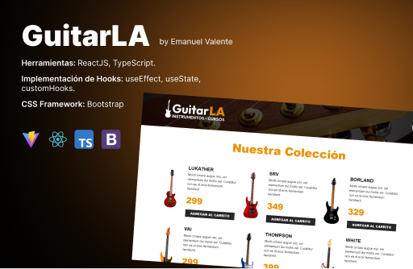

# Guitar LA - ecommerce site

This is a new version of E-Cart simulation, where users can add items to cart, increase and decrease quantity and remove them.

This project was made with Vite + React + Typescript This time appling Reducer and useReducer hook for state managment.

- Production link: https://guitarla-ts-reducer.netlify.app/

## Preview:

